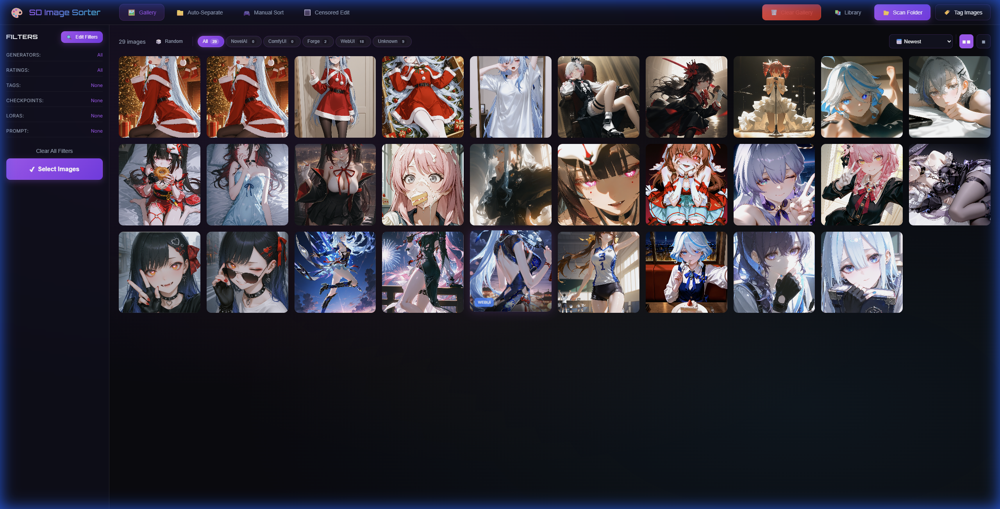
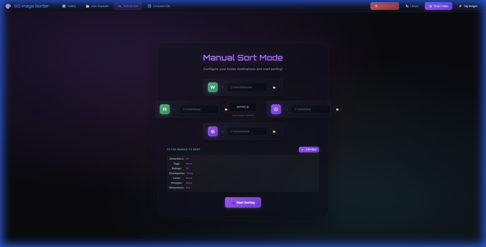
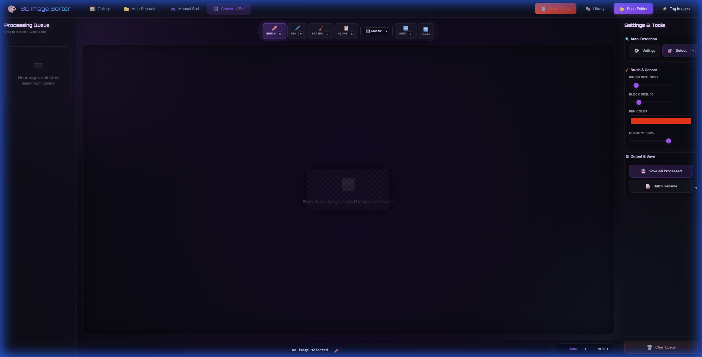
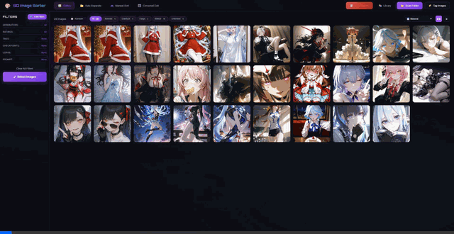

# SD Image Sorter (AI 图像筛选管理器)

[English](#english) | [简体中文](#简体中文)

---

<a name="english"></a>

# 🎨 SD Image Sorter

A powerful image management tool for Stable Diffusion users. Automatically extract metadata, tag images with AI, filter, sort, and organize your AI-generated artwork with a premium glassmorphism UI.


---

### 🤔 Sound familiar?

> - 😵 Tons of images — some have metadata, some don't, and you can't tell them apart
> - 🔍 Want to filter by specific tags / prompts / models, but existing tools just can't do it
> - 📚 Want to build a local tags/prompts library from your own image collection
> - 🔳 Auto-censor always misjudges, only draws rigid rectangles, and you can't manually tweak it
> - 🧹 Want to batch-strip metadata, or selectively keep it after censoring
>
> **Give this tasty tool a try! 🍜**

---

## 📸 Screenshots

| Gallery View | Manual Sort | Censor Edit |
|:------------:|:-----------:|:-----------:|
|  |  |  |

## 🎬 Demo

| Gallery Navigation | Manual Sort Flow |
|:------------------:|:----------------:|
|  |  |

---

## ✨ Features

### 🖼️ Gallery Management
- **Multi-source support**: ComfyUI, NovelAI, WebUI/Forge, and unknown formats
- **Metadata extraction**: Automatically reads prompts, settings, checkpoints, and LoRAs
- **Advanced filtering**: Filter by generator, tags, ratings, checkpoints, LoRAs, prompts, or dimensions
- **Smart sorting**: Sort by date, name, prompt length, tag count, or rating

### 🏷️ AI Tagging (WD14 Tagger)
- **High-accuracy models**: EVA02-Large, SwinV2, ConvNeXt, etc.
- **Dual thresholds**: Separate recognition sensitivity for general vs. character tags
- **Rating classification**: Predicts General, Sensitive, Questionable, or Explicit

### 📁 Image Organization & Sorting
- **Auto-Separate**: Bulk move images matching filters to specific destination folders
- **Manual Sort**: Fast, "game-like" sorting using **WASD** keys
- **Undo Support**: Instantly revert sorting actions

### 🔳 Censor Edit (V2)
- **AI Detection**: YOLOv8-based detection of sensitive areas (requires model)
- **Multiple Styles**: Mosaic, blur, black bar, or white bar
- **Precision Tools**: Manual brush, eraser, and clone stamp for detail work
- **Batch Processing**: Queue-based workflow with batch save and rename

---

## 🚀 Quick Start

### Prerequisites
- **Python 3.9+**
- **Windows** (Recommended) or Linux/Mac

### Installation & Run

1. **Clone/Download** the repository:
   ```bash
   git clone https://github.com/peter119lee/sd-image-sorter.git
   cd sd-image-sorter
   ```

2. **Run the app**:
   - **Windows**: Double-click `run.bat`
   - **Linux/Mac**: Run `chmod +x run.sh && ./run.sh`

3. **Access UI**: Open `http://localhost:8000` in your browser.

*The first run will automatically set up a virtual environment and install dependencies.*

---

## 📖 Complete Tutorial (Playback Teaching Guide)

This section provides a step-by-step walkthrough of every feature in the SD Image Sorter.

### 🔹 Step 1: Launching the Application

1. **Start the server**:
   - Double-click `run.bat` (Windows) or run `./run.sh` (Linux/Mac)
   - Wait for the message: `Application startup complete`
   
2. **Open the web interface**:
   - Navigate to `http://localhost:8000` in your browser
   - You'll see the main Gallery view with the glassmorphism UI

### 🔹 Step 2: Scanning Your Image Folder

1. Click the **📂 Scan Folder** button in the top navigation bar
2. In the modal that appears:
   - Enter the **absolute path** to your image folder (e.g., `D:\AI_Images`)
   - The folder should contain PNG images with embedded metadata
3. Click **Start Scan**
4. Watch the progress bar as images are indexed
5. Once complete, images appear in the gallery grid

> **💡 Tip**: Images from different generators (ComfyUI, NovelAI, WebUI/Forge) are automatically detected based on their metadata format.

### 🔹 Step 3: AI Tagging with WD14 Tagger

1. Click the **🏷️ Tag Images** button
2. In the tagging modal:
   - **Select a model** (recommended: `wd-eva02-large-tagger-v3`)
   - Adjust **General Threshold** (default: 0.35) - higher = fewer tags
   - Adjust **Character Threshold** (default: 0.85) - for character recognition
3. Click **Start Tagging**
4. The progress shows which image is being processed
5. Tags and ratings will be added to each image

> **💡 Tip**: The first run downloads the model (~500MB). Subsequent runs are faster.

### 🔹 Step 4: Understanding the Gallery Interface

#### Generator Tabs
Located below the header, these filter images by their source:
- **All** - Shows all scanned images
- **Forge** - Images from Forge/WebUI
- **WebUI** - Automatic1111 WebUI images  
- **NovelAI** - NovelAI generated images
- **ComfyUI** - ComfyUI workflow images
- **Unknown** - Images without recognizable metadata

#### Image Grid
- **Hover** over an image to see a quick preview tooltip
- **Click** an image to open the detail view
- **Right-click** opens context menu with options

#### Gallery Tools
- **🎲 Random** - Jump to a random image
- **Sort dropdown** - Sort by: Newest, Oldest, Filename, Prompt Length, Tag Count, Rating
- **View toggles** - Switch between Grid and Single image view

### 🔹 Step 5: Using the Filter System

Click the **Filters** section in the left sidebar to expand filter options:

#### 5.1 Rating Filter
Filter by content rating (assigned by AI tagging):
- **General** - Safe for work content
- **Sensitive** - Mildly suggestive
- **Questionable** - More suggestive content
- **Explicit** - Adult content

#### 5.2 Tag Filter
1. Type a tag name in the search box (e.g., "1girl", "blue_hair")
2. Select tags from the autocomplete dropdown
3. Multiple tags can be combined (AND logic)
4. Click the **X** to remove a tag filter

#### 5.3 Checkpoint Filter
1. Expand the **Checkpoints** section
2. Click a checkpoint name to filter images using that model
3. Shows count of images per checkpoint

#### 5.4 LoRA Filter
1. Expand the **LoRAs** section
2. Click a LoRA name to filter images using it
3. Multiple LoRAs can be selected

#### 5.5 Prompt Filter
1. Enter keywords in the **Prompts** search box
2. Filters images containing that text in their prompt
3. Uses substring matching (e.g., "girl" matches "1girl", "girls")

#### 5.6 Dimension & Aspect Ratio Filter
Click the **More Filters** button to access:
- **Min/Max Width**: Filter by pixel width range
- **Min/Max Height**: Filter by pixel height range
- **Aspect Ratio**: Portrait, Landscape, or Square

#### Clearing Filters
- Click **Clear All Filters** to reset all filter selections
- Individual filters can be removed by clicking them again

### 🔹 Step 6: Auto-Separate (Batch Move)

Navigate to the **Auto-Separate** tab:

1. Set your **Source** path (or use currently filtered images)
2. Set your **Destination** folder path
3. Configure filter criteria (same as Gallery filters)
4. Click **Start Separation**
5. Images matching the criteria are moved to the destination

> **⚠️ Warning**: This operation moves files. Use with caution.

### 🔹 Step 7: Manual Sort (WASD Sorting)

Navigate to the **Manual Sort** tab for rapid keyboard-based sorting:

#### Setup
1. Set up to **4 destination folders** for W, A, S, D keys:
   - **W slot**: e.g., `D:\Sorted\Best`
   - **A slot**: e.g., `D:\Sorted\Good`
   - **S slot**: e.g., `D:\Sorted\OK`
   - **D slot**: e.g., `D:\Sorted\Delete`
2. Click **🎮 Start Sorting**

#### Controls
| Key | Action |
|:---:|:-------|
| `W` | Move image to W-slot folder |
| `A` | Move image to A-slot folder |
| `S` | Move image to S-slot folder |
| `D` | Move image to D-slot folder |
| `Space` | Skip current image (keep in place) |
| `Z` | Undo last action |
| `Esc` | Exit sorting mode |

#### Workflow
1. Image displays in full view
2. Press W/A/S/D to move, Space to skip
3. Next image automatically loads
4. Press Z anytime to undo
5. Progress counter shows remaining images

### 🔹 Step 8: Censor Edit (Privacy Masking)

Navigate to the **Censor Edit** tab:

#### Adding Images to Queue
1. In Gallery, select images using checkboxes
2. Click **🔳 Censor Edit** in the floating action bar
3. Images are added to the Censor Edit queue

#### AI Auto-Detection
1. In the right sidebar, set your **YOLO model path** (`.pt` file)
2. Adjust **Confidence threshold** (default: 0.25)
3. Click **🎯 Detect Current** for single image
4. Click **🎯 Detect All** to process entire queue

#### Manual Editing Tools
| Tool | Hotkey | Description |
|:-----|:------:|:------------|
| Brush | `B` | Paint censor areas with selected style |
| Pen | `P` | Precise thin line censoring |
| Eraser | `E` | Remove censor marks (restore original) |
| Clone Stamp | `G` | Clone from another area |

#### Brush Settings
- **Size**: Adjust with `[` and `]` keys, or slider
- **Style**: Mosaic, Blur, Black Bar, White Bar

#### Canvas Controls
- **Zoom**: `Ctrl + Scroll` or zoom buttons
- **Pan**: Click and drag when zoomed in
- **Undo**: `Ctrl + Z`

#### Navigation
- `A` / `D` - Previous / Next image in queue
- Queue panel shows all images with processing status

#### Saving
1. Review all censored images
2. Click **💾 Save Current** for single image
3. Click **💾 Save All Processed** for batch save
4. Choose output folder and naming convention

---

## ⌨️ Complete Keyboard Shortcuts

### Gallery View
| Keys | Action |
|:-----|:-------|
| `Arrow Keys` | Navigate between images |
| `Enter` | Open selected image details |
| `Escape` | Close modals/detail view |

### Manual Sort Mode
| Keys | Action |
|:-----|:-------|
| `W / A / S / D` | Move to assigned folder |
| `Space` | Skip current image |
| `Z` | Undo last action |
| `Escape` | Exit sorting mode |

### Censor Edit Mode
| Keys | Action |
|:-----|:-------|
| `A / D` | Previous / Next image |
| `B` | Brush tool |
| `P` | Pen tool |
| `E` | Eraser tool |
| `G` | Clone stamp tool |
| `[ / ]` | Decrease / Increase brush size |
| `Ctrl + Z` | Undo last stroke |
| `Ctrl + Scroll` | Zoom canvas |

---

## 🔧 Advanced Configuration

### Environment Variables
Create a `.env` file in the `backend` folder:

```env
# Server settings
HOST=0.0.0.0
PORT=8000

# Database path (default: ./database.db)
DATABASE_PATH=./database.db

# Models cache directory
MODELS_CACHE=./models
```

### API Endpoints

The backend provides a REST API for programmatic access:

| Endpoint | Method | Description |
|:---------|:------:|:------------|
| `/api/images` | GET | List images with filters |
| `/api/images/{id}` | GET | Get single image details |
| `/api/analytics` | GET | Get statistics and tag counts |
| `/api/tags` | GET | List all available tags |
| `/api/scan` | POST | Scan a folder for images |
| `/api/tag` | POST | Run AI tagging on images |
| `/api/move` | POST | Move images to folder |

### Filter Parameters
When querying `/api/images`:
- `generators` - Comma-separated generator names
- `rating` - general, sensitive, questionable, explicit
- `tags` - Comma-separated tag names
- `checkpoint` - Checkpoint name
- `loras` - Comma-separated LoRA names
- `prompt` - Text search in prompts
- `min_width`, `max_width` - Width range
- `min_height`, `max_height` - Height range
- `aspect_ratio` - portrait, landscape, square

---

## 🛠️ Troubleshooting

### Common Issues

**Q: Images don't show after scanning**
- Ensure the path is absolute (e.g., `D:\Images` not `Images`)
- Check that images are PNG format with embedded metadata
- Look for errors in the terminal console

**Q: Tagging is slow**
- First run downloads the model (~500MB)
- GPU acceleration requires CUDA-compatible GPU
- Reduce batch size in settings for less memory usage

**Q: Filters show wrong counts**
- Click "Clear All Filters" and re-apply
- Run "Fix Rating Tags" in settings if rating counts seem off
- Refresh the page after major database operations

**Q: Manual Sort undo doesn't work**
- Undo only works within the current sorting session
- Files that were already moved manually cannot be undone

---

## 📁 Project Structure

```
sd-image-sorter/
├── backend/
│   ├── main.py           # FastAPI application entry
│   ├── database.py       # SQLite database operations
│   ├── image_manager.py  # Image metadata handling
│   ├── tagger.py         # WD14 AI tagging
│   ├── censor.py         # Censor detection logic
│   ├── routers/          # API route modules
│   │   ├── images.py     # Image CRUD endpoints
│   │   ├── tags.py       # Tag management
│   │   ├── sorting.py    # Sorting operations
│   │   └── censor.py     # Censor edit endpoints
│   └── utils/
│       └── path_validation.py  # Security utilities
├── frontend/
│   ├── index.html        # Main HTML template
│   ├── css/
│   │   └── style.css     # Glassmorphism styling
│   └── js/
│       ├── app.js        # Main application logic
│       ├── gallery.js    # Gallery interactions
│       └── censor-edit.js # Censor editor
├── models/               # Downloaded AI models
├── run.bat               # Windows launcher
└── README.md             # This file
```

---

## 🤝 Contributing

Contributions are welcome! Please:
1. Fork the repository
2. Create a feature branch
3. Make your changes
4. Submit a pull request

---

## 📄 License

This project is licensed under the MIT License - see the [LICENSE](LICENSE) file for details.

---

<br>

<a name="简体中文"></a>

# 🎨 SD Image Sorter (AI 图像筛选管理器)

专为 Stable Diffusion 用户设计的图像管理工具，具备极简玻璃拟态 UI。支持自动元数据提取、AI 打标、智能过滤和极速排序。

---

### 🤔 如果你正在烦恼...

> - 😵 一大堆图片有些有元数据、有些没有，完全分不清楚
> - 🔍 想快速过滤特定的 tags / prompts / models，却发现现有工具做不到  
> - 📚 想基于自己的图库建立本地 tags/prompts 资料库
> - 🔳 想自动打码却发现 YOLO 总是误判 / 自动打出来的码只有死板的长方形，又不能手动细修
> - 🧹 想批量清除图片的元数据 / 或者打完码后想选择性保留原始元数据
>
> **那就来试试这个顶级美味吧！🍜**

---

## 📸 软件截图

| 画廊视图 | 手动排序 | 打码编辑 |
|:--------:|:--------:|:--------:|
|  |  |  |

## 🎬 演示动画

| 画廊导航 | 手动排序流程 |
|:--------:|:------------:|
|  |  |

---

## ✨ 功能特性

### 🖼️ 画廊管理
- **全面兼容**: 支持 ComfyUI, NovelAI, WebUI/Forge 等多种生成工具
- **深度解析**: 自动读取正反向提示词、采样参数、模型信息及 LoRA
- **精准过滤**: 支持按生成器、标签、内容分级、模型、LoRA、尺寸组合筛选
- **智能排序**: 支持按时间、提示词长度、标签密度或分级排序

### 🏷️ AI 自动打标 (WD14 Tagger)
- **多模型矩阵**: 集成 EVA02-Large, SwinV2 等高精度打标模型
- **双重阈值**: 针对通用内容与角色特征分别定义识别灵敏度
- **安全评级**: 自动识别并标注内容分级（General 到 Explicit）

### 📁 自动化整理与排序
- **自动分类 (Auto-Separate)**: 将符合过滤条件的图片一键归集到指定文件夹
- **快捷手动排序**: 独创"WASD"键位操作，像玩游戏一样快速分类图片
- **撤销机制**: 实时撤销误操作，排序流程更安全

### 🔳 隐私打码 (Censor Edit V2)
- **智能识别**: 依托 YOLOv8 自动锁定敏感区域（需自备模型）
- **多样化处理**: 提供马赛克、模糊、纯色遮盖等多种打码方式
- **精细修补**: 内置画笔、橡皮擦及仿制图章，满足手动精度需求
- **批量导出**: 队列化工作流，支持批量重命名与保存

---

## 🚀 快速开始

### 环境要求
- **Python 3.9+**
- **Windows** (推荐) 或 Linux/Mac

### 安装与运行

1. **获取代码**:
   ```bash
   git clone https://github.com/peter119lee/sd-image-sorter.git
   cd sd-image-sorter
   ```

2. **启动程序**:
   - **Windows**: 双击 `run.bat`
   - **Linux/Mac**: 运行 `chmod +x run.sh && ./run.sh`

3. **访问界面**: 使用浏览器打开 `http://localhost:8000`

*首次启动将自动创建虚拟环境并补全依赖包。*

---

## 📖 完整使用教程

### 🔹 第1步：扫描图片入库
1. 点击顶部导航栏的 **📂 Scan Folder**
2. 输入图片所在文件夹的绝对路径（例如 `D:\AI_Images`）
3. 点击 **Start Scan**，程序将扫描并建立本地索引数据库

### 🔹 第2步：AI 自动打标
1. 点击 **🏷️ Tag Images**
2. 选择推荐模型 `wd-eva02-large-tagger-v3`
3. 调整识别阈值（通用标签：0.35，角色标签：0.85）
4. 点击 **Start Tagging**

### 🔹 第3步：使用筛选器
展开左侧 **Filters** 面板：
- **评级过滤**: General / Sensitive / Questionable / Explicit
- **标签过滤**: 输入标签名称搜索
- **模型过滤**: 点击 Checkpoint 名称筛选
- **LoRA过滤**: 点击 LoRA 名称筛选
- **提示词过滤**: 输入关键词搜索提示词
- **尺寸过滤**: 设置宽度/高度范围，或选择横竖比

### 🔹 第4步：极速手动分类
1. 切换至 **Manual Sort** 标签页
2. 为 **W/A/S/D** 四个槽位选择目标路径
3. 点击 **🎮 Start Sorting** 开启排序
4. 敲击 **W/A/S/D** 移动图片，**空格** 跳过，**Z** 撤销

### 🔹 第5步：隐私打码编辑
1. 在画廊中选中图片，点击浮动栏的 **🔳 Censor Edit**
2. 在右侧侧边栏指定 YOLO 模型路径并调整置信度
3. 点击 **🎯 Detect Current** 自动识别敏感点
4. 使用工具栏进行精修后，点击 **💾 Save All Processed** 批量保存

---

## ⌨️ 快捷键指南

| 场景 | 按键 | 动作 |
|:-----|:-----|:-----|
| **手动排序** | `W / A / S / D` | 移动到指定槽位 |
| | `空格` | 跳过当前图片 |
| | `Z` | 撤销上一步操作 |
| **打码编辑** | `A / D` | 切换上/下一张 |
| | `B / P` | 画笔 / 铅笔工具 |
| | `E` | 橡皮擦 (恢复原图) |
| | `G` | 仿制图章 |
| | `[ / ]` | 调整笔触大小 |
| | `Ctrl+Z` | 撤销编辑 |
| | `Ctrl+滚轮` | 画布缩放 |

---

## 📄 开源协议

本项目基于 MIT 协议开源 - 详见 [LICENSE](LICENSE) 文件。

---

## 💡 小贴士 (Tips & Hints)

> [!TIP]
> **拖拽读图**: 看到喜欢的图片？直接从 Gallery 拖拽到 ComfyUI 就能读取工作流啦！

> [!TIP]  
> **精细修正**: 在 Censor Edit 打码后，如果自动检测多画了一些区域，用 Eraser 工具 (`E` 键) 擦掉即可恢复原图。

> [!TIP]
> **批量工作流**: 在 Censor Edit 中可以拖动重新排列图片顺序 → 批量重命名 → 决定要不要保留元数据 → 最后一键导出，超级方便！

> [!TIP]
> **快捷键加速**: 熟练使用 `WASD` + `Space` + `Z` 组合，手动排序的速度堪比打游戏！

---

## 🙏 Special Thanks

This project wouldn't be possible without these amazing contributors and their inspiring work:

| Contributor | Contribution |
|:------------|:-------------|
| **[Antigravity](https://github.com/peter119lee)** & **Claude Opus 4.5 (Thinking)** | 💻 Core development & AI-assisted coding |
| **[Wenaka2004](https://github.com/Wenaka2004/auto-censor)** | 💡 Auto-censor concept inspiration |
| **Wenaka2004** | 🎯 [YOLO detection model](https://civitai.com/models/1736285?modelVersionId=1965032) |
| **[Spawner1145](https://github.com/spawner1145/comfyui-lsnet)**, **DraconicDragon**, **heathcliff01** | 🔮 LSNet inspiration *(feature coming soon!)* |
| **[SmilingWolf](https://huggingface.co/SmilingWolf/wd-eva02-large-tagger-v3)** | 🏷️ WD14 Tagger models |
| **[Receyuki](https://github.com/receyuki/stable-diffusion-prompt-reader)** | 📖 Prompt reader concept inspiration |

---

## 🐛 Feedback & Contributions

Got ideas? Found a bug? We'd love to hear from you!

- 📝 **Issues**: [Report bugs or request features](../../issues)
- 🔧 **Pull Requests**: Contributions are always welcome!
- 💬 **Discussion**: Feel free to start a conversation in Issues

---

*Made with ❤️ for the Stable Diffusion community*
